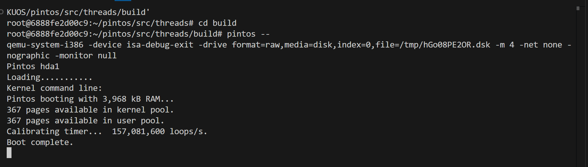
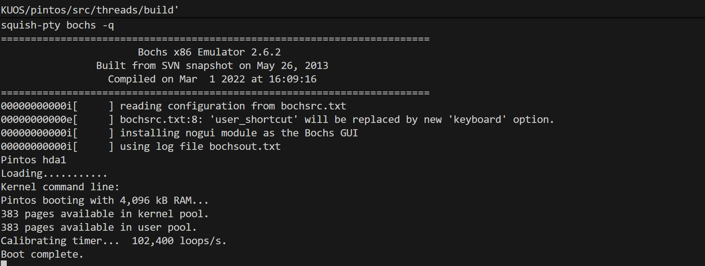
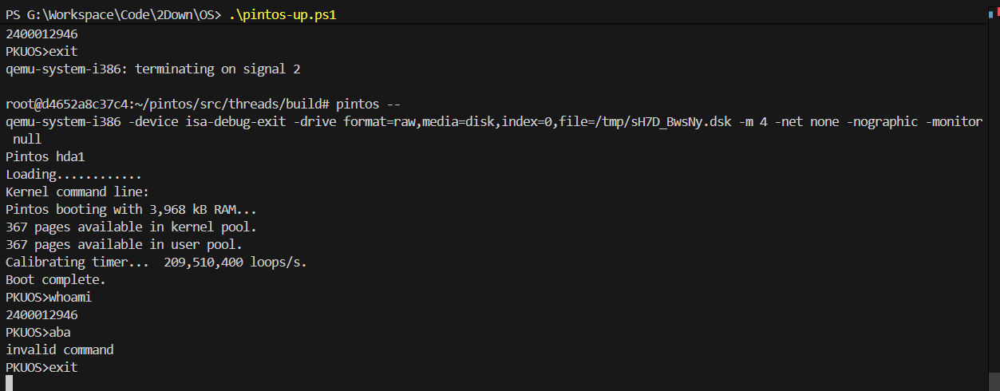

# Project 0: Getting Real

## Preliminaries

>Fill in your name and email address.

钟骏宇，2400012946@stu.pku.edu.cn

>If you have any preliminary comments on your submission, notes for the TAs, please give them here.

>Please cite any offline or online sources you consulted while preparing your submission, other than the Pintos documentation, course text, lecture notes, and course staff.

## Booting Pintos

>A1: Put the screenshot of Pintos running example here.

## Debugging

#### QUESTIONS: BIOS 

>B1: What is the first instruction that gets executed?

``ljmp   $0x3630,$0xf000e05b``

>B2: At which physical address is this instruction located?

0xFFFF0

#### QUESTIONS: BOOTLOADER

>B3: How does the bootloader read disk sectors? In particular, what BIOS interrupt is used?

via int 0x13,specifically in read_sector it sets AH = 0x42 and invokes int 0x13 (int13 Extended Read Sectors)

>B4: How does the bootloader decides whether it successfully finds the Pintos kernel?

The bootloader scans the partition table on each system hard disk,and check whether it is unused, a pintos kernel partition(type is 0x20) and a bootable partition(type is 0x80).When it finds such a partition, it assumes that the Pintos kernel is there and starts loading it.

>B5: What happens when the bootloader could not find the Pintos kernel?

the bootloader prints ``"\rNot found\r"`` and invokes ``int 0x18`` to report boot failure.

>B6: At what point and how exactly does the bootloader transfer control to the Pintos kernel?

at 0x7cbf.After loading the kernel into memory, the bootloader reads the kernel entry point from the loaded ELF header, constructs a real-mode far pointer, and transfers control with ``ljmp *start``

#### QUESTIONS: KERNEL

>B7: At the entry of pintos_init(), what is the value of expression `init_page_dir[pd_no(ptov(0))]` in hexadecimal format?
>Ans:0x0

>B8: When `palloc_get_page()` is called for the first time,

>> B8.1 what does the call stack look like?
>>Ans:
>>#0  palloc_get_page (flags=(PAL_ASSERT | PAL_ZERO)) at ../../threads/palloc.c:113
>>#1  0xc00203aa in paging_init () at ../../threads/init.c:168
>>#2  0xc002031b in pintos_init () at ../../threads/init.c:100
>>#3  0xc002013d in start () at ../../threads/start.S:180 

>> B8.2 what is the return value in hexadecimal format?
>>
>> Ans:0xc0101000

>> B8.3 what is the value of expression `init_page_dir[pd_no(ptov(0))]` in hexadecimal format?
>>
>> Ans:0x0

>B9: When palloc_get_page() is called for the third time,

>> B9.1 what does the call stack look like?
>> Ans:
>>#0  palloc_get_page (flags=PAL_ZERO) at ../../threads/palloc.c:113
>>#1  0xc0020a81 in thread_create (name=0xc002e895 "idle", priority=0, function=0xc0020eb0 <idle>, aux=0xc000efbc) at ../../threads/thread.c:178
>>#2  0xc0020976 in thread_start () at ../../threads/thread.c:111
>>#3  0xc0020334 in pintos_init () at ../../threads/init.c:119
>>#4  0xc002013d in start () at ../../threads/start.S:180

>> B9.2 what is the return value in hexadecimal format?
>>
>> Ans:0xc0103000

>> B9.3 what is the value of expression `init_page_dir[pd_no(ptov(0))]` in hexadecimal format?
>>
>> Ans:0x102027

## Kernel Monitor

>C1: Put the screenshot of your kernel monitor running example here. (It should show how your kernel shell respond to `whoami`, `exit`, and `other input`.)

#### 

>C2: Explain how you read and write to the console for the kernel monitor.
>
>Use the functions in input.c and "printf()".
>
>"Read_line_myself()" realize the input and echo and check whether it is '\r'('\n") , printable symbol or none of them,more than that the function can handle "backspace" key.
>
>and do some if and else in the "pintos_init()" to handle command "whoami" and "exit",just print or break.
>
>It is also important to note that input_init() has already been executed during kernel initialization,as a part of my work of reading program:)

