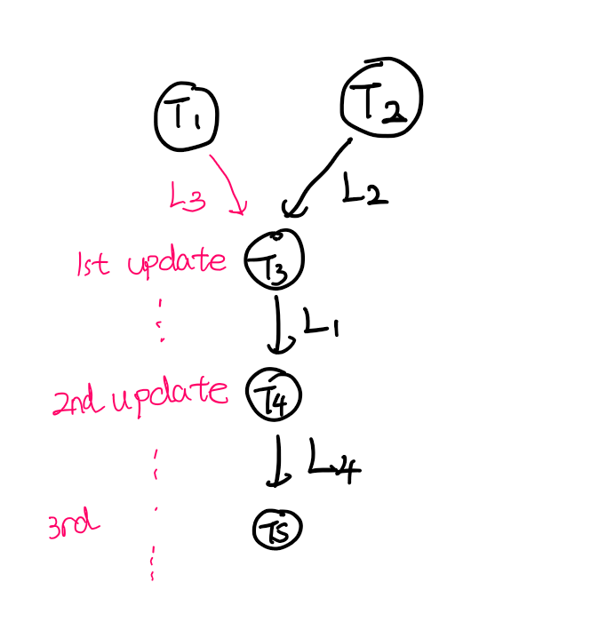

# Project 1: Threads

## Preliminaries

>Fill in your name and email address.

钟骏宇 2400012946@stu.pku.edu.cn

>If you have any preliminary comments on your submission, notes for the
>TAs, please give them here.


>Please cite any offline or online sources you consulted while
>preparing your submission, other than the Pintos documentation, course
>text, lecture notes, and course staff.


## Alarm Clock

#### DATA STRUCTURES

>A1: Copy here the declaration of each new or changed struct or struct member, global or static variable, typedef, or enumeration.  Identify the purpose of each in 25 words or less.

```
struct foo
{
  struct list_elem elem;
  int64_t wakeup_time;
  struct thread *t;
};
```
记录睡眠线程的唤醒时间和线程指针，通过elem组织成链表。

``struct list sleep_list;``
用来管理所有 timer_sleep 了的线程的链表，按照唤醒时间排序。

我也新定义了个函数 ``static bool time_less``，就是为了调用 ``list.h`` 的 ``list_insert_ordered`` 时塞的比较函数。

#### ALGORITHMS

>A2: Briefly describe what happens in a call to timer_sleep(),
>including the effects of the timer interrupt handler.

直接把当前线程的唤醒时间和线程指针封装成一个 foo 结构体，插入到 sleep_list 链表中，并阻塞当前线程。

timer_interrupt 每次被调用时会检查 sleep_list 中是否有线程需要被唤醒，如果有就把它们从链表中移除并 unblock。

（考虑优先级的话，若唤醒线程优先级更高还得调用 thread_yield_on_return()）。

>A3: What steps are taken to minimize the amount of time spent in
>the timer interrupt handler?

维护有序链表，按照唤醒时间从小到大排序，插入时动态维护，这样 timer interrupt handler 里面只需要从前往后检查且可以早停。
#### SYNCHRONIZATION

>A4: How are race conditions avoided when multiple threads call
>timer_sleep() simultaneously?

timer_sleep() 会首先调用 intr_disable()，从而确保了对全局链表的搜索和插入操作是原子的，避免多线程出现的 race。

>A5: How are race conditions avoided when a timer interrupt occurs
>during a call to timer_sleep()?

禁用了中断所以 timer_interrupt 不会在 timer_sleep() 执行过程中打断它。

#### RATIONALE

>A6: Why did you choose this design?  In what ways is it superior to
>another design you considered?

设计：维护有序 sleep_list。

对比：
- 比原来的忙等待好，kernel ticks 更少
- 时间复杂度更大程度上依赖于 sleep 线程数量（插入时动态维护有序链表），而不是 timer ticks 数量（timer interrupt handler 检查少）。

## Priority Scheduling

#### DATA STRUCTURES

>B1: Copy here the declaration of each new or changed struct or struct member, global or static variable, typedef, or enumeration.  Identify the purpose of each in 25 words or less.

在 `struct thread` (thread.h) 中新增：
```c
int base_priority;              /* 线程自身设定的基础优先级，不受捐赠影响。 */
struct list donate_priority;    /* 直接捐赠给本线程的 donate_elem 链表。 */
struct lock *waiting_lock;      /* 本线程正在等待的锁，NULL 表示不在等待。 */
```
以及 `priority` 字段语义改为"有效优先级"，由 `donate_priority_update()` 动态计算。

在 synch.c 中新增：
```c
struct donate_elem
{
  struct list_elem elem;       /* 链表节点 */
  struct lock *lock;           /* 此捐赠关联的锁，释放锁时据此清除对应捐赠。 */
  struct thread *donor;        /* 捐赠者线程指针，用于动态读取其当前优先级。 */
};
```

>B2: Explain the data structure used to track priority donation.
>Use ASCII art to diagram a nested donation.  (Alternately, submit a
>.png file.)

每个持锁线程维护一个 `donate_priority` 链表，记录所有因等待该线程所持锁而直接捐赠的 `donate_elem`。每个 `donate_elem` 存放 `donor` 指针和 `lock` 指针。

`donate_priority_update(t)` 遍历 t 的 `donate_priority` 链表，动态读取每个 `donor->priority`，取 `max(base_priority, 所有 donor->priority)` 作为有效优先级。因为读的是 donor 的当前 `priority`（而非静态快照），嵌套捐赠自动传递。



例如这里黑色是先前存在的锁依赖关系，现在 ``lock_acquire(t1)`` 触发 t1 向 t3 捐赠，给 t3 的 `donate_priority` 链表插入一个 `donate_elem`，其中 `donor = t1`。调用 donate_priority_update(t3)，然后再递归调用 t3 的直接捐赠者 t4 的 donate_priority_update(t4)，就能自动把 t1 的优先级传递到 t4，后续过程同理。

#### ALGORITHMS

>B3: How do you ensure that the highest priority thread waiting for
>a lock, semaphore, or condition variable wakes up first?

- Semaphore: `sema_up()` 中使用 `list_min` 找到等待队列中优先级最高的线程，将其移除并 unblock。注意 list_min 是取 less_func，所以会取出最大值。
- Lock: 底层基于 semaphore，继承上述行为。
- Condition variable: `cond_signal()` 中用 `list_min` （其中 `less_func` 更复杂—— `cond_sema_priority_greater` 比较各 `semaphore_elem` 中等待线程的最高优先级）找到优先级最高的 waiter，唤醒它。

>B4: Describe the sequence of events when a call to lock_acquire()
>causes a priority donation.  How is nested donation handled?

1. 关中断。
2. 若 `lock->holder != NULL`（锁被占）：
   a. 在栈上创建 `donate_elem de`，其中的 `lock` 和 `donor` 都是当前 lock 和 thread，毕竟就是当前这个线程拿不到这个锁，于是沿这个锁进行捐赠。
   b. 设置 `thread_current()->waiting_lock = lock`。
   c. 将 `de` 按优先级降序插入 `lock->holder->donate_priority` 链表。
   d. 链式传播：从 `lock->holder` 开始，沿 `waiting_lock` 链向上遍历，对每个线程调用 `donate_priority_update()` 重算有效优先级（这就实现了嵌套捐赠）。
3. 恢复旧中断状态。
4. `sema_down()` 阻塞等待。（因为被阻塞所以 de 一直在栈上有效）
5. 获得锁后设置 `lock->holder = thread_current()`。

>B5: Describe the sequence of events when lock_release() is called
>on a lock that a higher-priority thread is waiting for.

1. 关中断。
2. 遍历当前线程的 `donate_priority` 链表，移除所有 `de->lock == lock` 的捐赠记录；同时将对应 donor 的 `waiting_lock` 清 NULL。
3. 调用 `donate_priority_update(thread_current())` 重算有效优先级。
4. 设置 `lock->holder = NULL`。
5. 恢复旧中断状态。
6. 调用 `sema_up()`，其中选出等待队列中优先级最高的线程 unblock，然后 `thread_yield()` 让出 CPU（若被唤醒线程优先级更高，立即切换）。

#### SYNCHRONIZATION

>B6: Describe a potential race in thread_set_priority() and explain
>how your implementation avoids it.  Can you use a lock to avoid
>this race?

因为 `thread_set_priority()` 也是要访问全局数据结构 ready_list 来决定是否需要 `thread_yield()`，例如在 if 判断和 `thread_yield()` 之间被中断，且插入了一个更高优先级的线程，那么就会错过让出 CPU 的时机。

所以需要在 `thread_set_priority()` 中关中断 ``interrupt_disable(),interrupt_set_level()``，确保整个操作是原子的。

无法使用 lock 避免 race，毕竟不能让 timer_interrupt 获取锁，那就没法用锁实现禁用中断的效果了。

#### RATIONALE

>B7: Why did you choose this design?  In what ways is it superior to
>another design you considered?

优势：
- 嵌套捐赠自动传递：`donate_priority_update` 动态读 `donor->priority`，当链中间节点的优先级被更新后，上游节点再次 update 时自然看到新值，无需在每个 `donate_elem` 里维护和同步静态优先级副本。
- `lock_acquire` 只在直接持有者的链表中插入一次 `donate_elem`，避免了插入多个 `donate_elem` 导致的指针空间复杂管理。

对比个人废案：
- 方案 B（在 `donate_elem` 中存静态 priority 值）：反正也要沿链更新所有相关的 `donate_elem`。
- 方案 C（当前 acquire 会给所有直接和间接的线程的 `donate_priority_queue` 都插入 `donate_elem`）：需要 malloc？其实没 debug 出来（ 


## Advanced Scheduler

#### DATA STRUCTURES

>C1: Copy here the declaration of each new or changed struct or struct member, global or static variable, typedef, or enumeration.  Identify the purpose of each in 25 words or less.

在 `struct thread`（thread.h）中新增：
```c
int nice;        /* 优先级的可调控参数， same as the definition in 4.4BSD Schedule  */
int recent_cpu;  /* 占用了多少 CPU 时间， same as the definition in 4.4BSD Schedule  */
```

在 thread.c 中新增：
```c
static int load_avg;  /* CPU 负载的衡量，same as the definition in 4.4BSD Schedule  */
```

总之都是为了计算线程的优先级。

新增头文件 `threads/fixed-point.h`，定义 17.14 定点数运算宏。

#### ALGORITHMS

>C2: How is the way you divided the cost of scheduling between code
>inside and outside interrupt context likely to affect performance?

当前算法所有 MLFQS 相关参数的固定周期更新均在中断上下文（`timer_interrupt`）中完成：

每 4 tick 一次对所有线程 priority 的重算 ``thread_priority_calc_mlfqs``（还有每秒 ``thread_recent_cpu_calc_mlfqs``）会需要对所有线程遍历并更新。
``thread_recent_cpu_incre`` 这种只需修改当前线程参数的开销倒还好。

普通的 MLFQS api 函数显然放在中断上下文之外，毕竟与时间无关也不需要禁用中断，不影响中断处理时间。

从划分来讲主要的 cost 集中在中断上下文里了，确实会因为线程数增加而增加中断处理时间，但这是 MLFQS 本身的设计使然，无法通过调整代码结构来优化。

#### RATIONALE

>C3: Briefly critique your design, pointing out advantages and
>disadvantages in your design choices.  If you were to have extra
>time to work on this part of the project, how might you choose to
>refine or improve your design?

优点：
- 无需维护 MLFQS 原定义中的多级就绪队列，ready_list 仍然是单一链表，调度逻辑更简单。
- ready_list 仍然有序，`next_thread_to_run` 直接取头部线程，调度 O(1)。
- 定点数运算全部封装在宏里，调用处可读性好。

缺点：
- `load_avg_calc_mlfqs` 中用 `list_size(&ready_list)` 是 O(n) 操作（Pintos 链表没有缓存 size）。

可以维护一个全局计数器，在 `thread_unblock`/`thread_block` 时更新，将其降为 O(1)。

>C4: The assignment explains arithmetic for fixed-point math in
>detail, but it leaves it open to you to implement it.  Why did you
>decide to implement it the way you did?  If you created an
>abstraction layer for fixed-point math, that is, an abstract data
>type and/or a set of functions or macros to manipulate fixed-point
>numbers, why did you do so?  If not, why not?

用 `define` 实现

1. 零运行时开销：宏在预处理阶段展开，所有运算直接内联。
2. 无需额外 .c 文件.
3. 类型透明：定点数本质就是 `int`，反正也不需要封装成 struct 或 typedef。

但是现在就缺乏类型检查，传错参数编译器不会报错。若项目规模更大，可以考虑用 `static inline` 函数代替，兼顾性能和类型安全。